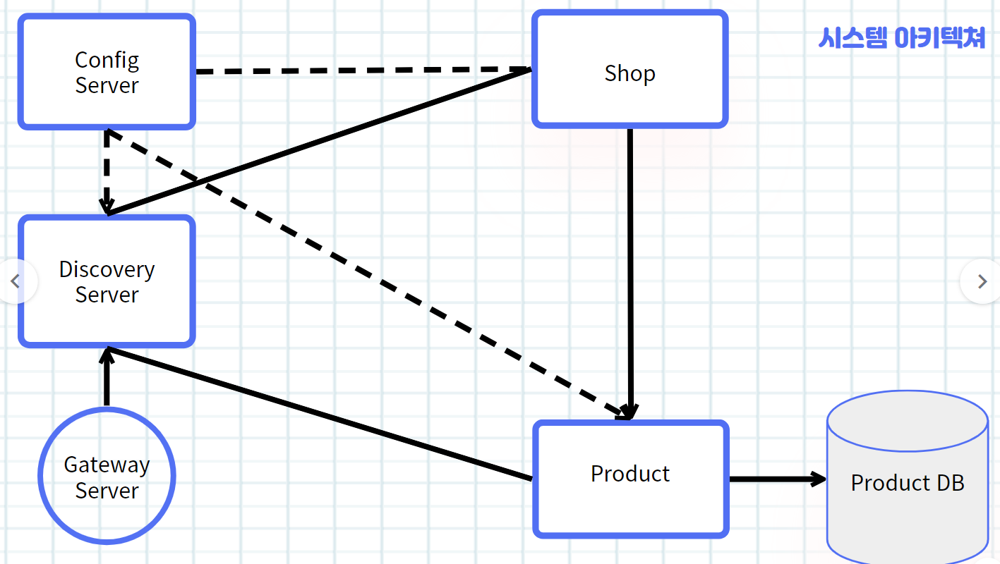
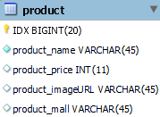

**\< 동양시스템즈 1기 미니프로젝트\>**

  ---------------- ------------------------------------------------------

  ---------------- ------------------------------------------------------

  -----------------------------------------------------------------------
  **조 명**          1조
  ------------------ ----------------------------------------------------
  **작성일자**       2023.10.11

  **조 원**          한수찬, 한지인, 나현성, 권용환
  -----------------------------------------------------------------------

#  {#section .TOC-Heading}

# 목 차 {#목-차 .TOC-Heading}

+-----------------------------------------------------------------------+
| [**1. 프로젝트 개요 [3](#_Toc142368770)**](#_Toc142368770)            |
|                                                                       |
| [**2. 서비스 아키텍처 3**](#_Toc142368771)                            |
|                                                                       |
| [**3. 소프트웨어 개발 환경 4**](#_Toc142368772)                       |
|                                                                       |
| [**4. 데이터베이스 5**](#_Toc142368773)                               |
|                                                                       |
| [4.1 ERD 5](#_Toc142368774)                                           |
|                                                                       |
| [4.2 테이블 정의서 5](#_Toc142368775)                                 |
|                                                                       |
| [**5. 기능 6**](#_Toc142368778)                                       |
|                                                                       |
| [5.1 주요 기능 6](#_Toc142368779)                                     |
|                                                                       |
| [5.2 화면구성 7](#_Toc142368780)                                      |
|                                                                       |
| [**6. 팀 구성 및 역할 분담**](#_Toc142368784) **9**                   |
|                                                                       |
| [6.1 팀 구성](#_Toc142333319) 9                                       |
|                                                                       |
| [6.2 역할 분담](#_Toc142368792) 9                                     |
|                                                                       |
| [6.2.1 한수찬 9](#_Toc142368793)                                      |
|                                                                       |
| [6.2.2 한지인](#_Toc142368793) 9                                      |
|                                                                       |
| [6.2.3 나현성](#_Toc142368793) 9                                      |
|                                                                       |
| [6.2.4 권용환](#_Toc142368793) 9                                      |
|                                                                       |
| [**7. 일정 [1](#_Toc142368794)**](#_Toc142368794)0                    |
+=======================================================================+
+-----------------------------------------------------------------------+

[]{#_Toc142368770 .anchor}

**1. 프로젝트 개요**

[]{#_Toc142368771 .anchor}"다모아"는 상품을 판매하고자 하는 사이트
관리자들이 자신들의 상품 등록 및 삭제, 수정을 할 수 있다. 이러한 상품
관리를 통해 사이트 관리자들이 수 많은 이용자들에게 판매하고자 하는
상품을 보여줄 수 있다.

**2. 서비스 아키텍처**

본 프로젝트 "다모아"는 다음과 같은 아키텍처로 구성되어 있다. Config
Server를 구축해 Discovery Server들의 Properties를 관리했다. API Gateway
서버를 이용해 Discovery server들을 로드밸런싱 하고 CircuitBreaker를
사용해 시스템 과부화에 대응이 가능하게 구현했다.

{width="5.383031496062992in"
height="3.038882327209099in"}

[]{#_Toc142368772 .anchor}

**3. 소프트웨어 개발 환경**

  ------------------------------------------------------------------------
  **구분**    **제품명**                 **기능**
  ----------- -------------------------- ---------------------------------
  OS          Windows 11                 개발 PC OS

  DB          MySQL                      DBMS

              MySQL Workbench            DB HANDLING

  언어        Java 17                    Service Server

  IDE         InteliJ                    개발 툴

              ECLIPSE                    개발 툴

              SpringToolSuite            개발 툴

  F/W         Spring Boot                Web Application 및 Server 개발

  Container   DOCKER                     서버 가상화

  library     Spring-Cloud               서버 및 DB 설정 라이브러리

              Spring Boot Starter        

  Build       Maven                      라이브러리 의존성 설정
  ------------------------------------------------------------------------

[]{#_Toc142368773 .anchor}

4\. 데이터베이스

[]{#_Toc142368774 .anchor}

**4.1 ERD**

{width="1.8648436132983377in"
height="1.3647736220472442in"}

**4.2 테이블 정의서**

**4.2.1 MEMBER**

  -------------------------------------------------------------------------------------------------------
  **테이블명**       PRODUCT                     **테이블명(한글)**            상품                    
  ------------------ ---------------- ---------- -------------------- -------- ----------------------- --
  **컬럼명**         **데이터타입**   **길이**   **NULL**             **PK**   **컬럼 설명**           

  IDX                BIGINT           20         No                   PK       상품 식별용 index       

  PRODUCT_NAME       VARCHAR          45         No                            상품명                  

  PRODUCT_PRICE      INT              11         YES                           상품 가격               

  PRODUCT_IMAGEURL   VARCHAR          45         YES                           상품 이미지 저장?URL    

  PRODUCT_MALL       VARCHAR          45         YES                           상품 판매사명           
  -------------------------------------------------------------------------------------------------------

[]{#_Toc142368778 .anchor}

**5. 기능**

[]{#_Toc142368779 .anchor} **5.1 주요 기능**

**5.1.1 사용자**

  ---------------------------------------------------------------------------
  **분류**   **분류    **기능**     **기능 상세**
             상세**                 
  ---------- --------- ------------ -----------------------------------------
  사용자     회원      상품관리     상품 CRUD

  ---------------------------------------------------------------------------

**5.1.2 상품 관리**

  ----------------------------------------------------------------------------
  **분류**   **분류     **기능**      **기능 상세**
             상세**                   
  ---------- ---------- ------------- ----------------------------------------
  상품 조회  검색       검색          검색어를 통해 해당하는 상품을 검색

             조회       상품 조회     선택된 상품의 상세 정보 출력

  상품 등록  등록       상품 등록     입력된 상품 내용들을 등록

                        상품 이미지   상품의 이미지 등록
                        등록          

  상품 수정  수정       상품 수정     상품에 대한 상세
                                      정보(상품명,가격,재고,상품 상세 내용,
                                      이미지 첨부) 기능

  상품 삭제  삭제       상품 삭제     리스트업 된 상품 목록 중 선택된 상품들을
                                      삭제
  ----------------------------------------------------------------------------

[]{#_Toc142368780 .anchor}**5.2 화면 구성**

+------------------------------------------+---------------------------+
| **???**                                  |                           |
+==========================================+===========================+
| {width="3.7036701662292213in" | 클릭시 상품 추가          |
| height="0.846107830271216in"}            |                           |
+------------------------------------------+---------------------------+
| {width="2.286713692038495in" | 저장되어 있는 상품들 정보 |
| height="2.290886920384952in"}            | 조회                      |
|                                          |                           |
| {width="2.360951443569554in" | 저장되어있는 해당 상품    |
| height="2.5430194663167103in"}           | 정보 조회                 |
+------------------------------------------+---------------------------+
| {width="3.24284230096238in" | DB에 해당 상품 정보 삭제  |
| height="0.9316447944006999in"}           |                           |
|                                          | ○ 추가하기 버튼 클릭 시   |
| {width="2.52115813648294in" |                           |
| height="2.3895308398950132in"}           |                           |
+------------------------------------------+---------------------------+

**6. 팀 구성 및 역할 분담**[]{#_Toc142333319 .anchor}

**6.1 역할 분담**

**6.1.1 한수찬**

  ----------------------------------------------------------------------------
  **구분**   **분류**   **분류상세**   **역할**
  ---------- ---------- -------------- ---------------------------------------
  API        상품       서비스 서버    Shop/product 서버 백엔드 개발

                        Discovery 서버 Eureka 서버 백엔드 개발

                        로드 밸런싱    Feign 기반 로드밸런싱 백엔드 개발

                        회복성 패턴    서킷 브레이커 \| 풀백 메소드 백엔드
                                       개발

                        가상화         도커 컨테이너 빌드 백엔드 개발

                        인프라         전체 인프라 리소스 세팅 백엔드 개발

  DB         \-         DB서버         MYSQL DB서버(우분투 도커) 백엔드 개발
  ----------------------------------------------------------------------------

**6.1.2 한지인**

  --------------------------------------------------------------------------
  **구분**   **분류**   **분류상세**   **역할**
  ---------- ---------- -------------- -------------------------------------
  발표       \-         발표자료       PPT작성

  API        \-         Add 페이지     상품 추가 페이지 프론트 개발
  --------------------------------------------------------------------------

**6.1.3 나현성**

  --------------------------------------------------------------------------------
  **구분**   **분류**   **분류상세**   **역할**
  ---------- ---------- -------------- -------------------------------------------
  API        상품       ConfigServer   서비스 서버 설정 주입 서버 프론트/백엔드
                                       개발

  DB         \-         Product        Product 테이블 백엔드 개발

  보고서     \-         보고서         보고서 작성
  --------------------------------------------------------------------------------

**6.1.4 권용환**

  ---------------------------------------------------------------------------------
  **구분**   **분류**    **분류상세**   **역할**
  ---------- ----------- -------------- -------------------------------------------
  API        상품        CRUD           JPA기반 상품 CRUD

  API        \-          Gateway        Gateway 서버 백엔드 개발
  ---------------------------------------------------------------------------------

[]{#_Toc142368794 .anchor}

7\. 일정

  --------------------------------------------------------------------------
  **작업 및 일정**    **W1**            **W2**                     
  ------------------- -------- -------- -------- -------- -------- ---------
                      **1**    **2**    **3**    **4**    **5**    **6**

  아이디어 회의                                                    

  기능 도출 및 분석                                                
  설계                                                             

  시스템 아키텍처                                                  
  설계                                                             

  데이터베이스 설계                                                

  기능 개발                                                        

  통합 테스트                                                      

  보고서 작성                                                      

  발표 자료 작성                                                   
  --------------------------------------------------------------------------
